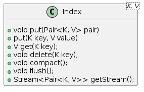

Branch master

[](https://github.com/jajir/jbindex/actions/workflows/maven.yml?query=branch%3Amaster) 

Branch devel

[](https://github.com/jajir/jbindex/actions/workflows/maven.yml?query=branch%3Adevel) 

# jbindex

A Java library for efficiently storing and retrieving large key-value maps.

# jbindex

Goal is to provide easy to use key value map for billions of records using just one directory and some space.

It's simple fast index. Work with index should be split into phases of:

* Writing data to index. All data that should be stored in index should be send to index.
* Building index. In this phase data are organized for fast access.
* Search through index. In this phase it's not possible to alter data in index.

Index is not thread safe.

## Useful links

* [Overall index architecture](architecture.md)
* [Index configuration](configuration.md)
* [Project versioning and how to release snapshot and new version](release.md)
* [Segment implementation details](segment.md)

## Basic work with index

Index could be in following states:



Index should be created with builder, which make index instance. For example:

```java
final Index<Integer, String> index = Index.<Integer, String>builder()
        .withDirectory(directory)
        .withKeyClass(Integer.class)
        .withValueClass(String.class)
        .build();
```


Interruption of process of writing data to index could lead to corruption of entire index.

## Limitations

### Staled result from index.getStream() method

Data from `index.getStream()` method could be staled or invalid. It's corner case when next readed key value pair is changed. Index data streaming is splited into steps `hasNextElement()` and `getNextElement()`. Following example will show why it's no possible to use index cache:

```java
index.hasNextElement(); // --> true
```

Now next element has to be known to be sure that exists. Let's suppose that in index is just one element `<k1,v1>`.

```java
index.delete("k1");
index.nextElement(); // --> fail
```

last operation will fail because there is not possible to find next element because `<k1,v1>` was deleted. To prevent this problem index cache is not used during index streaming. If all index content should be streamed than before streaming should be `compact()` method and during streaming data shouldn't be changed.
