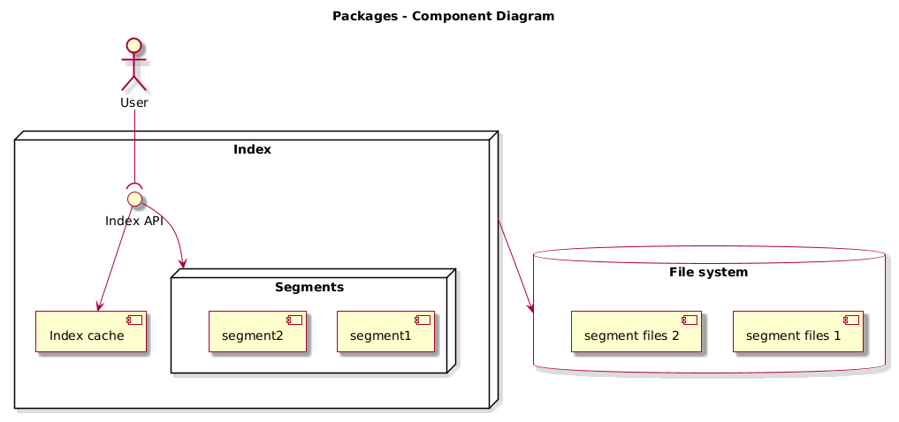

# Architecture

Here is described basic index concepts. This page explain you how to correctly configure index.

## Operation consistency

In one case method `getStream()` could return inconsistent result. Soemtimes getStream() could omit some results. Here are cases:

* When segment is compacted. When data from segment are streamed and during this process some new keys are added to this segment than segment stop provide another keys. In that case stream operation continue in next segment or ends when there is no more segment to prosess.

* When new key is added. When completly new key is added to index and this key is just in main index cache. In that case will not be returned.

Both cases could be prevented by calling `compact()` before calling `getStream()` and make sure that new keys are not added during streaming.

Update some value in index by caling `put()` or delete `delete()` doesn't break anythning. Updated value will returned and deleted key not will be returned from stream.

Other operations like `get()` are always consistent.