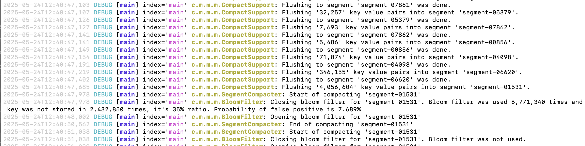

# Logging

HestiaStore uses **slf4j** for internal logging. So you should include your preferred logging library like logback, log4j, or another with a bridge to slf4j. In case you use log4j, look at the example configuration:

## Example configuration File for log4j

Bellow is the example Log4j2 configuration used in HestiaStore:

```xml
<?xml version="1.0" encoding="UTF-8"?>
<Configuration status="INFO">
  <Appenders>

    <Console name="Console" target="SYSTEM_OUT">
      <PatternLayout
          pattern="%style{%d{ISO8601}}{white} %highlight{%-5level }[%style{%t}{bright,blue}] %style{%-C{1.mv}}{bright,yellow}: %msg%n%throwable" />
    </Console>

    <Console name="indexAppender" target="SYSTEM_OUT">
      <PatternLayout
          pattern="%style{%d{ISO8601}}{white} %highlight{%-5level }[%style{%t}{bright,blue}] index='%style{%X{index.name}}{magenta}' %style{%-C{1.mv}}{bright,yellow}: %msg%n%throwable" />
    </Console>

  </Appenders>
  <Loggers>
    <logger name="com.hestiastore.index" level="DEBUG" additivity="false">
      <appender-ref ref="indexAppender" />
    </logger>
    <Root level="DEBUG">
      <AppenderRef ref="Console"/>
    </Root>
  </Loggers>
</Configuration>
```

this example will produce logs look like this:



### Log Appenders

- **Console (default)**: Used by all components not explicitly assigned a logger. Outputs time, level, thread, and class name.
- **indexAppender**: Specifically configured for `com.hestiastore.index`, outputs additional context (`index.name`) for disambiguating messages from different index instances.

### Customizing Logging Levels

You can control verbosity by modifying the `<logger>` or `<Root>` levels:

- `ERROR`, `WARN`, `INFO`, `DEBUG`, or `TRACE`
- For example, to suppress general debug logs:

```xml
<Root level="INFO">
```

## Disabling Index Logs

If you want to disable index-specific logging entirely, remove or comment out the `com.hestiastore.index` logger section. Alternatively log level for package could be set to "ERROR".

## Recommendations

- Use `DEBUG` during development or troubleshooting.
- Switch to `INFO` or `WARN` in production to reduce log noise.
- Ensure you clear MDC values (`ThreadContext.clearAll()`) in thread pools to prevent memory leaks or incorrect context reuse.

## Logging Implementation

The `indexAppender` uses a mapped diagnostic context (MDC) value `index.name`, which should be set programmatically:

```java
ThreadContext.put("index.name", "userIndex");
```

This allows the log output to include which index instance the message is referring to, aiding in debugging concurrent access or behavior across multiple indexes.
