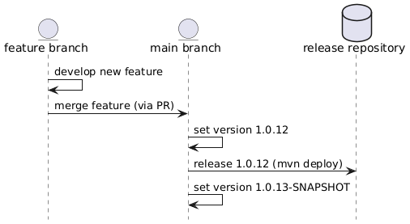

# Releasing new version

Simple guide how to make new release.

## Versioning of the project

Project use traditional versioning pattern. Version number consist of three numbers separated by dots. For example:

```
0.3.6
```

Meaning of number is:

* `0` - Major project version, project API could be incompatible between two major versions
* `3` - Minor project version contains changes in features, performance optimizations and small improvement. Minor versions should be compatible.
* `6` - Bug fixing project release

There are also snapshot versions with version number `0.3.6-SNAPSHOT`. Snapshot versions should not by sotred into maven repository.

## Branching strategy



We use a simplified GitHub Flow:

* `main`: the primary development and release branch. Small changes may be committed directly to `main`, while larger or experimental features must be developed in a separate branch and merged via pull request.
* Feature branches: created from `main` for larger or isolated changes. Use descriptive names like `feature/compression`, `fix/index-scan`, etc.

The previous `devel` branch is no longer used and has been removed.

## How to release new version

### Prerequisites

 Adjust settings.xml in `~/.m2/settings.xml` like this described at [github official documentation how to work with github maven repository](https://docs.github.com/en/packages/working-with-a-github-packages-registry/working-with-the-apache-maven-registry). Get correct token and it's done.

### Make release

Perform the following steps to create a new release:

1. Checkout the `main` branch:

   ```
   git checkout main
   ```

2. Set the release version:

   ```
   mvn versions:set -DnewVersion=0.0.12
   git commit -am "release: version 0.0.12"
   ```

3. Tag and push the release:

   ```
   git tag v0.0.12
   git push --follow-tags
   ```

4. Deploy the release (can be automated via GitHub Actions or done manually):

   ```
   mvn deploy
   ```

5. Bump to next snapshot version:

   ```
   mvn versions:set -DnewVersion=0.0.13-SNAPSHOT
   git commit -am "post-release: bumped to 0.0.13-SNAPSHOT"
   git push
   ```

That's it — the release is live and development can continue.

# How to use project

As release repository is used github packages. Released packages could be easily used in your project. In case of maven:

```
<dependency>
  <groupId>com.coroptis</groupId>
  <artifactId>jbindex</artifactId>
  <version>x.y.z</version>
</dependency>
```

## Helpfull commands

### How to use custom settings.xml file

```
mvn --settings ./src/main/settings.xml clean deploy
```

### How to use set maven project version

```
mvn versions:set -DnewVersion=1.0.1-SNAPSHOT
```

### Check dependencies

try to update dependencies. Check them with:

```
mvn versions:display-dependency-updates
```
