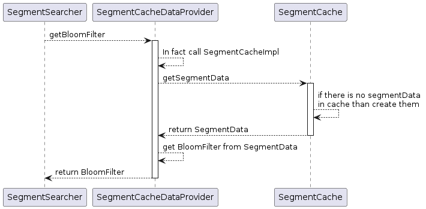
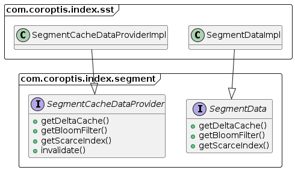
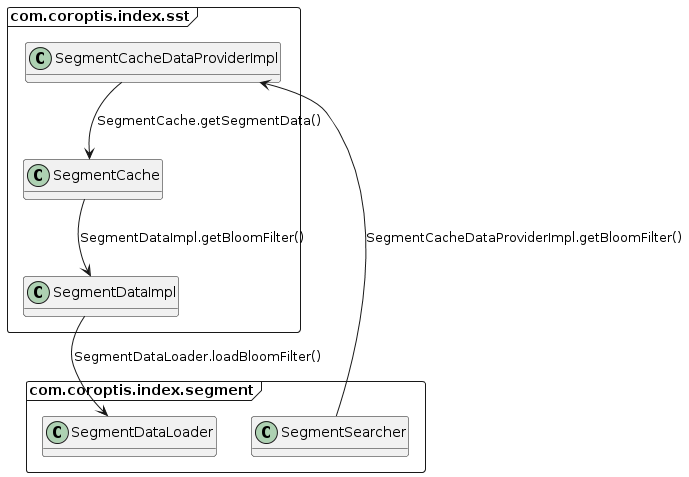

# Segment implementation

Segment is core piece of index. It represents one string sorted table file with some additional files.

## Caching of segment data

In segment following object are cached:
* SegmentDeltaCache - contains changed key value pair from segment
* BloomFilter - bloom filter data
* ScarceIndex - scarce index data

When in segment is needed for example BloomFilter that it obtained like this:

Object `SegmentData` could contains objects `SegmentDeltaCache`, `BloomFilter` and `ScarceIndex`. All of them are lazy loaded from `SegmentDataLoader`. Segment data and segment data loaders have interface and it's implementation in different packages. Main reason is to avoid dependency from `com.coroptis.index.segment` package to `com.coroptis.index.sst` package.

Following image shows references between objects in runtime:

