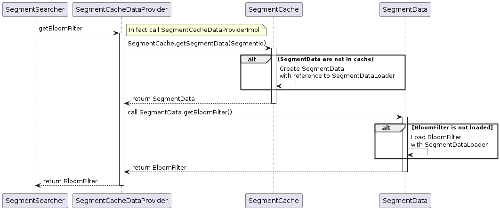
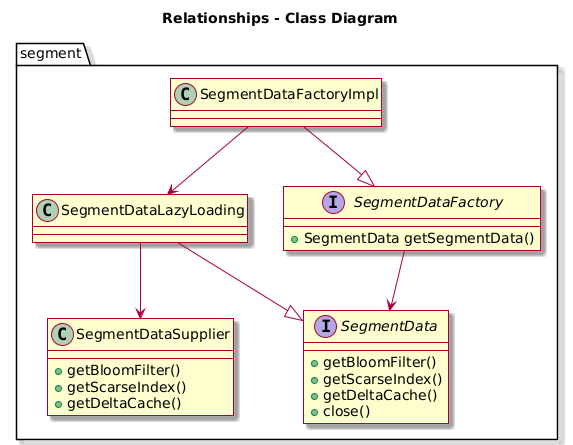
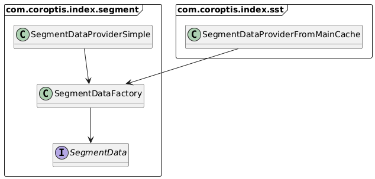
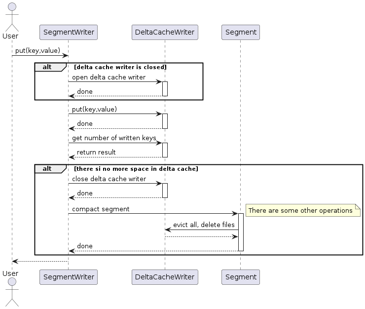

# Segment implementation

Segment is core part of index. It represents one string sorted table file with:

* Partial consistency - iterator stop working or return consistent data
* Support Writing changes into delta files
* Bloom filter for faster evaluating if key is in index
* Scarce index for faster searching for data in main index

## Segment put/get and iterate consistency

operations like write and get should be always consistent. What is written is read. Iteration behave differently. better than provide old data it stop providing any data. Generally it should work like this:

```
  put(A,1)
  put(B,1)
  put(C,1)
  iterator = getSegmentIetrator
  iterator.next() --> [A,1]
  put(B,2)
  put(C,2)
  iterator.next() --> [B,2]
  put(C,3)
  iterator.next() --> null
```

If last `put(C,3)` lead to index compacting than iterator couldn't provide correct value. So iterator better stop providing any values.

## Caching of segment data

In segment following object are cached:

* SegmentDeltaCache - contains changed key value pair from segment
* BloomFilter - bloom filter data
* ScarceIndex - scarce index data

When in segment is needed for example BloomFilter that it obtained like this:



Object `SegmentData` could contains objects `SegmentDeltaCache`, `BloomFilter` and `ScarceIndex`. All of them are lazy loaded from `SegmentDataLoader`. Segment data and segment data loaders have interface and it's implementation in different packages. Main reason is to avoid dependency from `com.coroptis.index.segment` package to `com.coroptis.index.sst` package.



Following image shows references between objects in runtime:



## Writing to segment

Writing up to some point shouldn't interrupt reading. Putting new pair into segment is here:


